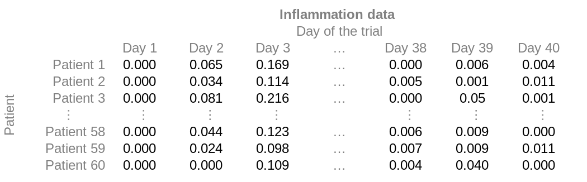

::::::::::::::::::::::::::::::::::::::: objectives

- "Read data from a csv to be able to work with it in matlab."
- "Familiarize ourselves with our sample data."

::::::::::::::::::::::::::::::::::::::::::::::::::

:::::::::::::::::::::::::::::::::::::::: questions

- "How can I load data to an array?"

::::::::::::::::::::::::::::::::::::::::::::::::::


## Loading data to an array

Reading data from files and writing data to them are essential tasks in scientific computing,
and something that we'd rather not spend a lot of time thinking about.
Fortunately, MATLAB comes with a number of high-level tools to do these things efficiently,
sparing us the grisly detail.

Before we get started, however, let's make sure we have the directories to help organise this project.

:::::::::::::::::::::::::::::::::::::::::  callout

## Tip: Good Enough Practices for Scientific Computing

[Good Enough Practices for Scientific Computing](https://swcarpentry.github.io/good-enough-practices-in-scientific-computing/)
is a paper written by researchers involved with the Carpentries,
which covers basic workflow skills for research computing.
It recommends the following for project organization:

1. Put each project in its own directory, which is named after the project.
2. Put text documents associated with the project in the `doc` directory.
3. Put raw data and metadata in the `data` directory, and files generated during clean-up and analysis in a `results` directory.
4. Put source code for the project in the `src` directory,
   and programs brought in from elsewhere or compiled locally in the `bin` directory.
5. Name all files to reflect their content or function.

::::::::::::::::::::::::::::::::::::::::::::::::::

We already have a `data`, `results` and `src` directories in our `matlab-novice-inflammation` project directory,
so we are ready to continue.

A final step is to set the *current folder* in MATLAB to our project folder.
Use the **Current Folder** window in the MATLAB GUI to browse to your project folder
(the one now containing the 'data', 'results' and 'src' directories).

To verify the current directory in matlab we can run `pwd` (print working directory).
A second check we can do is to run the `ls` (list) command in the Command Window to list the contents
of the working directory ---
we should get the following output:

```output
data  results  src
```


We are now set to load our data. As a reminder, our data is structured like this:

{alt='Information saved in each data file.'}

But it is stored without the headers, as comma-separated values. Each line in the file corresponds to a row, and
the value for each column is separated from its neighbours by a comma.
The first few rows of our first file, `data/base/inflammation-01.csv`, look like this:

```
0,0.065,0.169,0.271,0.332,0.359,0.354,0.333,0.304,0.268,0.234,0.204,0.179,0.141,0.133,0.115,0.083,0.076,0.065,0.065,0.047,0.04,0.041,0.028,0.02,0.028,0.012,0.02,0.011,0.015,0.009,0.01,0.01,0.007,0.007,0.001,0.008,-0,0.006,0.004
0,0.034,0.114,0.2,0.272,0.321,0.328,0.32,0.314,0.287,0.246,0.215,0.207,0.171,0.146,0.131,0.107,0.1,0.088,0.065,0.061,0.052,0.04,0.042,0.04,0.03,0.031,0.031,0.016,0.019,0.02,0.017,0.019,0.006,0.009,0.01,0.01,0.005,0.001,0.011
0,0.081,0.216,0.277,0.273,0.356,0.38,0.349,0.315,0.23,0.235,0.198,0.106,0.198,0.084,0.171,0.126,0.14,0.086,0.01,0.06,0.081,0.022,0.035,0.01,0.086,-0,0.102,0.032,0.07,0.017,0.136,0.022,-0,0.031,0.054,-0,-0,0.05,0.001
```

We can search the documentation to try to learn how to read our matrix of data.
Type `read matrix` into the documentation toolbar.
MATLAB suggests using `readmatrix`.
If we have a closer look at the documentation,
MATLAB also tells us which inputs and output this function has.

For the `readmatrix` function we need to provide a single
argument: the ***path*** to the file we want to read data from.
Since our data is in the 'data' folder, the path will begin with "data/",
we'll also need to specify the subfolder (we will start by using "base/"),
and this will be followed by the name of the file:
```matlab
>> patient_data = readmatrix('data/base/inflammation-01.csv');
```

This loads the data and assigns it to a variable, *patient_data*.
This is a good example of when to use a semi-colon to suppress output ---
try re-running the command without the semi-colon to find out why.
You should see a wall of numbers printed, which is the data from the file.

We can see in the workspace that the variable has 60 rows and 40 columns.
If you can't see the workspace, you can check this with `size`, as we did before:
```matlab
>> size(patient_data)
```
```output
ans =
    60 40
```

You might also recognise the icon in the workspace telling you that the variable is of type double.
If you don't, you can use the `class` function to find out what type of data lives inside an array:
```matlab
>> class(patient_data)
```
```output
ans =
    'double'
```

Again, this just means that you can store very small or very large numbers,
called double precision floating-point numbers.


## Initial exploration
We know that in our data each row represents a patient and each column a different day.

#### **One patient at a time**

We know how to access sections of our data, so lets look at a single patient first.
If we want to look at a single patients' data, then, we have to get all the columns for a given row, with:
```matlab
>> patient_5 = patient_data(5,:)
```
```output
patient_5 =
  Columns 1 through 14
         0    0.0370    0.1330    0.2280    0.3060    0.3410    0.3410    0.3480    0.3160    0.2750    0.2540    0.2250    0.1870    0.1630
  Columns 15 through 28
    0.1440    0.1190    0.1070    0.0880    0.0720    0.0600    0.0510    0.0510    0.0390    0.0330    0.0240    0.0280    0.0170    0.0200
  Columns 29 through 40
    0.0160    0.0200    0.0190    0.0180    0.0070    0.0160    0.0220    0.0180    0.0150    0.0050    0.0100    0.0100
```

Looking at these 40 numbers tells us very little, so we might want to look at the mean instead, for example.
```matlab
>> mean_p5=mean(patient_5)
```
```output
mean_p5 =
    0.1046
```
We can also compute other statistics, like the maximum, minimum and standard deviation.
```matlab
>> max_p5 = max(patient_5)
>> min_p5 = min(patient_5)
>> std_p5 = std(patient_5)
```
```output
max_p5 =
    0.3480
min_p5 =
     0
std_p5 =
    0.1142
```

:::::::::::::::::::::::::::::::::::::::  challenge

## All data points at once

Can you think of a way to get the mean of the whole data?
What about the `max`, `min` and `std`?


:::::::::::::::  solution

We already know that the colon operator as an index returns all the elements,
so `patient_data(:)` will return a vector with all the data points.
To compute the mean, we then use:
```matlab
>> global_mean = mean(patient_data(:))
```
```output
global_mean =
    0.1053
```
This works for `max`, `min` and `std` too:
```matlab
>> global_max = max(patient_data(:))
>> global_min = min(patient_data(:))
>> global_std = std(patient_data(:))
```
```output
global_max =
    0.4530
global_min =
     0
global_std =
    0.1118
```

:::::::::::::::::::::::::

::::::::::::::::::::::::::::::::::::::::::::::::::

Now that we have the global statistics, we can check how patient 5 compares with them:
```matlab
>> mean_p5 > global_mean
>> max_p5 == global_max
>> min_p5 == global_min
>> std_p5 < global_std
```
```
ans =
  logical
   0
ans =
  logical
   0
ans =
  logical
   1
ans =
  logical
   0
```
So we know that patient 5 did not suffer more inflamation than average,
that they are not the patient who got the most inflamed,
that they had the global minimum inflamation at some point (0),
and that the std of their inflamation is not below the average.

:::::::::::::::::::::::::::::::::::::::  challenge

## Food for thought

How would you find the patient who got the highest inflamation?

Would you be happy to do it if you had 1000 patients?

::::::::::::::::::::::::::::::::::::::::::::::::::

#### **One day at a time**

We could also have looked not at a single patient, but at a single day.
The approach would be very similar, but instead of selecting all the columns in a row,
we want to select all the rows for a given column:
```matlab
>> day_9 = patient_data(:,9);
```
The result is now not a row of 40 elements, but a column with 60 items.
However, matlab is smart enough to figure out what to do with enquieries just like the ones we did before.
```matlab
>> mean_d9 = mean(day_9)
>> max_d9 = max(day_9)
>> min_d9 = min(day_9)
>> std_d9 = std(day_9)
```
```output
mean_d9 =
    0.3116
max_d9 =
    0.3780
min_d9 =
    0.2290
std_d9 =
    0.0186
```

We could now check how day 9 compares to the global values:
```matlab
>> mean_d9 > global_mean
>> max_d9 == global_max
>> min_d9 == global_min
>> std_d9 < global_std
```
```
ans =
  logical
   1
ans =
  logical
   0
ans =
  logical
   0
ans =
  logical
   1
```
So we know that at day 9 there was significant inflamation,
but that it is not the day with the highest inflamation;
Also, that every patient was at least a bit inflamed at that moment,
and that the standard deviation of inflamation this day is below the standard deviation of the whole dataset (so datapoints are closer to each other).

:::::::::::::::::::::::::::::::::::::::  challenge

## Food for thought

How would you find which days had an inflamation value above the global mean?

Would you be happy to do it if you had 1000 days worth of data?

::::::::::::::::::::::::::::::::::::::::::::::::::

#### **Whole array analysis**

The analysis we've done until now would be very tedious to repeat for each patient or day.
Luckily, we've learnt that matlab is used to thinking in terms of arrays.
Surely it must be possible to get the mean of each patient or each day in one go.
It is definitely tempting to simply call the mean on the array, so let's try it:
```matlab
>> x=mean(patient_data);
```
We've supressed the output, but the workspace (or use of `size`) tells us that the result is a 1x40 array.
Matlab assumed that we want column averages, and indeed that is something we might want.

The other statistics behave in the same way, so we can more appropriately label our variables as:
```matlab
>> per_day_mean = mean(patient_data);
>> per_day_max = max(patient_data);
>> per_day_min = min(patient_data);
>> per_day_std = std(patient_data);
```

You'll notice that each of the above variables is a `1x40` array.

Now that we have the information for each day in an array,
we can take advantage of Matlab's capacity to do array operations.
For example, we can find out which days had an inflamation above the global average:
```matlab
>> per_day_mean > global_mean
```
```
ans =
  1×40 logical array
  Columns 1 through 20
   0   0   1   1   1   1   1   1   1   1   1   1   1   1   1   1   1   0   0   0
  Columns 21 through 40
   0   0   0   0   0   0   0   0   0   0   0   0   0   0   0   0   0   0   0   0
```
We could count which day it is, but lets take a shortcut and use the find function:
```matlab
>> find(ans)
```
```
ans =
     3     4     5     6     7     8     9    10    11    12    13    14    15    16    17
```
So it seems that days 3 to 17 were the critical days.


But what if we want the analysis per patient, instead of per day?

Lets look at the documentation for `mean`, either through the documentation browser or using the `help` command
```matlab
>> help mean
```
```output
mean   Average or mean value.
    S = mean(X) is the mean value of the elements in X if X is a vector. 
    For matrices, S is a row vector containing the mean value of each 
    column. 
    For N-D arrays, S is the mean value of the elements along the first 
    array dimension whose size does not equal 1.
 
    mean(X,DIM) takes the mean along the dimension DIM of X.
 
    S = mean(...,TYPE) specifies the type in which the mean is performed, 
    and the type of S. Available options are:
 
    'double'    -  S has class double for any input X
    'native'    -  S has the same class as X
    'default'   -  If X is floating point, that is double or single,
                   S has the same class as X. If X is not floating point, 
                   S has class double.
 
    S = mean(...,NANFLAG) specifies how NaN (Not-A-Number) values are 
    treated. The default is 'includenan':
 
    'includenan' - the mean of a vector containing NaN values is also NaN.
    'omitnan'    - the mean of a vector containing NaN values is the mean 
                   of all its non-NaN elements. If all elements are NaN,
                   the result is NaN.
 
    Example:
        X = [1 2 3; 3 3 6; 4 6 8; 4 7 7]
        mean(X,1)
        mean(X,2)
 
    Class support for input X:
       float: double, single
       integer: uint8, int8, uint16, int16, uint32,
                int32, uint64, int64
 
    See also median, std, min, max, var, cov, mode.
```

The first paragraph explains why it worked for a single day or patient.
The input we used was a vector, so it took the mean.

The second paragraph explains why we got per-day means when we used the whole data as input.
Our array is 2D, and the first dimention is the rows, so it averaged the rows.

The third paragraph is the key to what we want to do now. 
A second argument `DIM` can be used to specify the direction in which to take the mean.
If we want patient averages, we want the columns to be averaged, that is, dimension 2.
```matlab
>> per_patient_mean = mean(patient_data,2);
```

As expected, the result is a `60x1` vector, with the mean for each patient.

Unfortunately, `max`, `min` and `std` do not behave quite in the same way.
If you explore their documentation, you'll see that we need to add another argument,
so that the commands become:
```matlab
>> per_patient_max = max(patient_data,[],2);
>> per_patient_min = min(patient_data,[],2);
>> per_patient_std = std(patient_data,[],2);
```

All of the above return a `60x1` vector.

:::::::::::::::::::::::::::::::::::::::  challenge

## Most inflamed patients

Can you find the patients that got the highest inflamation?

:::::::::::::::  solution

Using the power matlab has to compare arrays,
we can check which patients have a `max` equal to the `global_max`.
If we wrap this check in the find function, we get the row numbers:
```matlab
>> find(per_patient_max == global_max)
```
```
ans =
     31
```
So patient 31 has the maximum inflamation level.

:::::::::::::::::::::::::

::::::::::::::::::::::::::::::::::::::::::::::::::

We can gain some insight exploring the data like we have so far,
but we all know that an image speaks more than a thousend numbers,
so we'll learn to make some plots.


:::::::::::::::::::::::::::::::::::::::: keypoints

- "Use `readmatrix` to read tabular CSV data into a program."
- "Use `mean`, `min`, `max`, and `std` on vectors to get the mean, minimum, maximum and standard deviation."
- "Use `mean(array,DIM)` to specify the dimension of your array in which to compute the mean."
- "For `min`, `max`, and `std`, the arguments need to be `(array,[],DIM)` instead."

::::::::::::::::::::::::::::::::::::::::::::::::::
