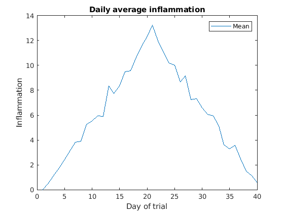
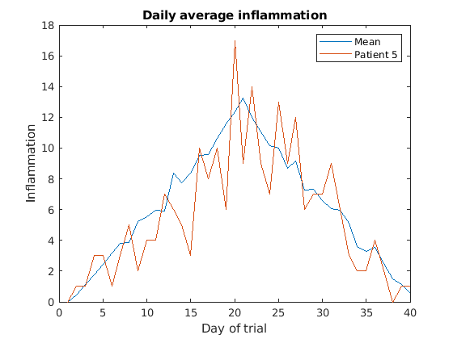
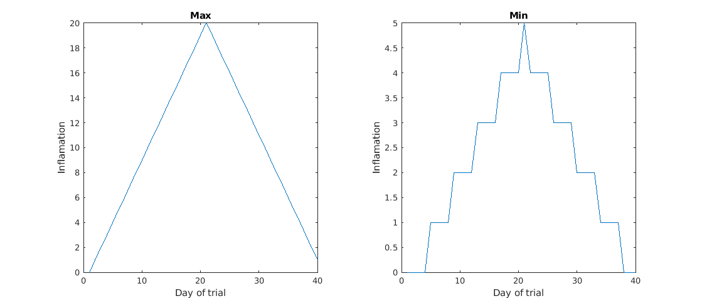
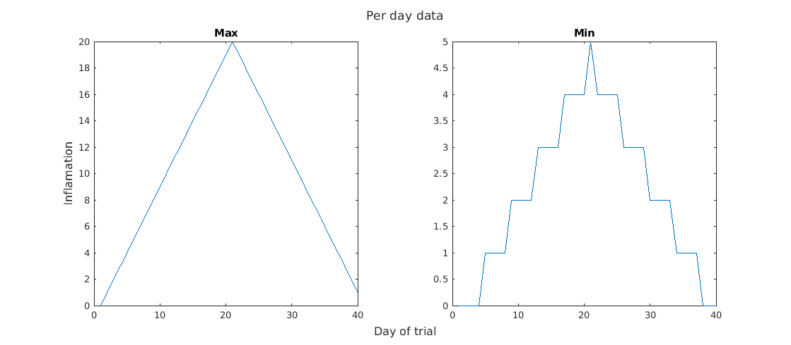
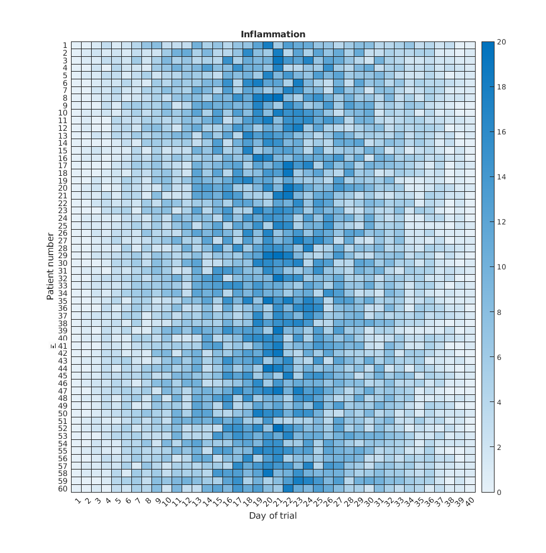

::::::::::::::::::::::::::::::::::::::: objectives

- "Display simple graphs with adequate titles and labels."
- "Get familiar with functions `plot`, `heatmap` and `imagesc`."
- "Learn how to show images side by side."

::::::::::::::::::::::::::::::::::::::::::::::::::

:::::::::::::::::::::::::::::::::::::::: questions

- "How can I visualize my data?"

::::::::::::::::::::::::::::::::::::::::::::::::::


## Plotting
The mathematician Richard Hamming once said,
"The purpose of computing is insight, not numbers," and the best
way to develop insight is often to visualize data. Visualization
deserves an entire lecture (or course) of its own, but we can
explore a few features of MATLAB here.

We will start by exploring the function `plot`.
The most common usage is to provide two vectors, like `plot(X,Y)`.
Lets start by plotting the the average (accross patients) inflammation over time.
For the `Y` vector we can provide `per_day_mean`,
and for the `X` vector we can simply use the day number,
which we can generate as a range with `1:40`.
Then our plot can be generated with:
```matlab
>> plot(1:40,per_day_mean)
```

:::::::::::::::::::::::::::::::::::::::::  callout

**Note:** If we only provide a vector as an argument it plots a data-point for each value on the y axis,
and it uses the index of each element as the x axis.
For our patient data the indices coincide with the day of the study,
so `plot(per_day_mean)` generates the same plot.
In most cases, however, using the indices on the x axis is not desireable.

::::::::::::::::::::::::::::::::::::::::::::::::::


:::::::::::::::::::::::::::::::::::::::::  callout

**Note:** We do not even need to have the vactor saved as a variable.
We would obtain the same plot with the command `plot(mean(patient_data, 1))`.

::::::::::::::::::::::::::::::::::::::::::::::::::

As it is, the image is not very informative.
We need to give the figure a `title` and label the axes using `xlabel` and `ylabel`,
so that other people can understand what it shows
(including us if we return to this plot 6 months from now).
```matlab
>> title('Daily average inflammation')
>> xlabel('Day of trial')
>> ylabel('Inflammation')
```

{alt='Average inflammation'}

Much better, now the image actually communicates something.

The result is roughly a linear rise and fall, which is suspicious:
based on other studies, we expect a sharper rise and slower fall.
Let's have a look at two other statistics: the maximum and minimum
inflammation per day across all patients.
```matlab
>> plot(per_day_max)
>> title('Maximum inflammation per day')
>> ylabel('Inflammation')
>> xlabel('Day of trial')
```

{alt='Maximum inflammation'}

```matlab
>> plot(per_day_min)
>> title('Minimum inflammation per day')
>> ylabel('Inflammation')
>> xlabel('Day of trial')
```

{alt='Minumum inflammation'}

From the figures, we see that the maximum value rises and falls perfectly
smoothly, while the minimum seems to be a step function. Neither result
seems particularly likely, so either there's a mistake in our
calculations or something is wrong with our data.

## Multiple lines in a plot

It is often the case that we want more than one line in a single plot.
In matlab we can "hold" a plot and keep plotting on top.
For example, we might want to contrast the mean values accross patients
with the information of a single patient.
If we are displaying more than one line, it is important we add a legend.
We can specify the legend names by adding `,'DisplayName',"legend name here"`
inside the plot function. We then need to activate the legend by running `legend`
So, to plot the mean values we first do:
```matlab
>> plot(per_day_mean,'DisplayName',"Mean")
>> legend
>> title('Daily average inflammation')
>> xlabel('Day of trial')
>> ylabel('Inflammation')
```

{alt='Average inflamation with legend'}

Then, we can use the instruction `hold on` to add a plot for patient_5.
```matlab
>> hold on
>> plot(patient_5,'DisplayName',"Patient 5")
>> hold off
```

{alt='Average inflamation and Patient 5'}

Remember to tell matlab you are done by adding `hold off` when you are done!


## Multiple plots in a figure

It is often convenient to show different plots side by side.
The [`tiledlayout(m,n)`](https://mathworks.com/help/matlab/ref/tiledlayout.html) command allows us to do just that.
The first two parameter define a grid of `m` rows and `n` columns in which our plots will be placed.
To be able to plot something on each of the tiles, we use the [`nexttile`](https://mathworks.com/help/releases/R2019b/matlab/ref/nexttile.html) command.
For example, we can show the average daily min and max plots together with:
```matlab
>> tiledlayout(1, 2)
>> nexttile
>> plot(per_day_max)
>> title('Max')
>> xlabel('Day of trial')
>> ylabel('Inflamation')
>> nexttile
>> plot(per_day_min)
>> title('Min')
>> xlabel('Day of trial')
>> ylabel('Inflamation')
```
{alt='Max Min tiledplot'}

We can also specify titles and labels for the whole tiled layout if we assign the tiled layout to a variable 
and pass it as a first argument to `title`, `xlabel` or `ylabel`, for example:
```matlab
>> tlo=tiledlayout(1, 2)
>> title(tlo,'Per day data')
>> xlabel(tlo,'Day of trial')
>> ylabel(tlo,'Inflamation')
>> nexttile
>> plot(per_day_max)
>> title('Max')
>> nexttile
>> plot(per_day_min)
>> title('Min')
```

{alt='Max Min tiledplot with shared labels'}

:::::::::::::::::::::::::::::::::::::::::  callout

**Note:** The [`subplot`](https://mathworks.com/help/matlab/ref/subplot.html)
command was deprecated in favour of `tiledlayout` in 2019.

::::::::::::::::::::::::::::::::::::::::::::::::::


## Heatmaps

If we wanted to look at all our data at the same time we need a three dimensions:
One for the patients, one for the days, and another one for the inflamation values.
An option is to use a heatmap, that is, use the colour of each point to represent the inflamation values.

In matlab, at least two methods can do this for us. 
The [`heatmap` function](https://uk.mathworks.com/help/matlab/ref/heatmap.html)
takes a table as input and produces a heatmap:
```matlab
>> heatmap(patient_data)
>> title('Inflammation')
>> xlabel('Day of trial')
>> ylabel('Patient number')
```

{alt='Heat map'}

We gain something by visualizing the whole dataset at once,
but it is harder to distinwish the overly linear rises and fall over a 40 day period.

Similarly, the [`imagesc` function](https://uk.mathworks.com/help/matlab/ref/imagesc.html)
represents the matrix as a color image. 
```matlab
>> imagesc(patient_data)
>> title('Inflammation')
>> xlabel('Day of trial')
>> ylabel('Patient number')
```

{alt='imagesc Heat map'}

Every value in the matrix is *mapped* to a color. 
Blue regions in this heat map are low values, while yellow shows high values.

Both functions provide very similar information, and can be tweaked to your liking.
The `imagesc` function is usually only used for purely numerical arrays,
whereas `heatmap` can process [tables](https://uk.mathworks.com/help/matlab/ref/table.html)
(that can have strings or categories in them).
In our case, which one you use is a matter of taste.

### Is all our data corrupt?
Our work so far has convinced us that something is wrong with our
first data file. We would like to check the other 11 the same way,
but typing in the same commands repeatedly is tedious and error-prone.
Since computers don't get bored (that we know of), we should create a
way to do a complete analysis with a single command, and then figure out
how to repeat that step once for each file. These operations are the
subjects of the next two lessons.


:::::::::::::::::::::::::::::::::::::::: keypoints

- "Use `plot(vector)` to visualize data in the y axis with an index number in the x axis."
- "Use `plot(X,Y)` to specify values in both axes."
- "Document your plots with `title('My title')`, `xlabel('My horizontal label')` and `ylabel('My vertical label')`."
- "Use `hold on` and `hold off` to plot multiple lines at the same time."
- "Use `legend` and add `,'DisplayName','legend name here'` inside the plot function to add a legend."
- "Use `tiledlayout(m,n)` to create a grid of `m` x `n` plots, and use `nexttile` to change the position of the next plot."

::::::::::::::::::::::::::::::::::::::::::::::::::
