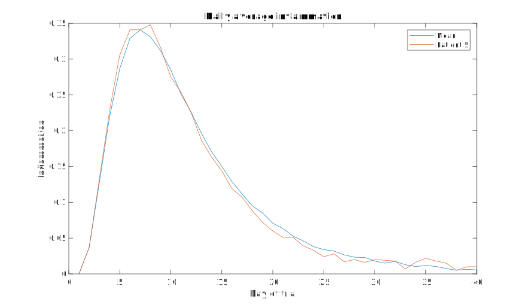

::::::::::::::::::::::::::::::::::::::: objectives

- Display simple graphs with appropriate titles and labels.
- Get familiar with the `plot` function.
- Learn how to plot multiple lines at the same time.
- Learn how to show images side by side.
- Get familiar with the `heatmap` and `imagesc` functions.

::::::::::::::::::::::::::::::::::::::::::::::::::

:::::::::::::::::::::::::::::::::::::::: questions

- How can I visualize my data?

::::::::::::::::::::::::::::::::::::::::::::::::::


## Plotting
The mathematician Richard Hamming once said,
"The purpose of computing is insight, not numbers," and the best
way to develop insight is often to visualise data. Visualisation
deserves an entire lecture (or course) of its own, but we can
explore a few features of MATLAB here.

We will be using the data that we have loaded from `inflammation-01.csv` and the `per_day_mean` and `per_day_max` variables.
If you haven't done so, you can load the data with:
```matlab
>> patient_data = readmatrix("data/base/inflammation-01.csv");
>> per_day_mean = mean(patient_data);
>> per_day_max = max(patient_data);
>> patient_5 = patient_data(5,:);
```

We will start by exploring the function `plot`.
The most common usage is to provide two vectors, like `plot(X,Y)`.
Lets start by plotting the average inflammation across patients over time.
For the `Y` vector we can provide `per_day_mean`,
and for the `X` vector we want to use the number of the day in the trial,
which we can generate as a range with:
```matlab
>> day_of_trial = 1:40;
```
Then our plot can be generated with:
```matlab
>> plot(day_of_trial, per_day_mean)
```

:::::::::::::::::::::::::::::::::::::::::  callout

**Note:** If we only provide a vector as an argument it plots a data-point for each value on the y axis,
and it uses the index of each element as the x axis.
For our patient data the indices coincide with the day of the study,
so `plot(per_day_mean)` generates the same plot.
In most cases, however, using the indices on the x axis is not desirable.

::::::::::::::::::::::::::::::::::::::::::::::::::


:::::::::::::::::::::::::::::::::::::::::  callout

**Note:** We do not even need to have the vector saved as a variable.
We would obtain the same plot with the command `plot(1:40, mean(patient_data, 1))`, or `plot(mean(patient_data, 1))`.

::::::::::::::::::::::::::::::::::::::::::::::::::

As it is, the image is not very informative.
We need to give the figure a `title` and label the axes using `xlabel` and `ylabel`,
so that other people can understand what it shows
(including us, if we return to this plot 6 months from now).
```matlab
>> title("Daily average inflammation")
>> xlabel("Day of trial")
>> ylabel("Inflammation")
```

{alt='Average inflammation'}

That's much better! Now the plot actually communicates something.
As we expected, this figure tells us way more than the numbers we had seen in the previous section.

Let's have a look at the maximum inflammation per day across all patients.
```matlab
>> plot(day_of_trial, per_day_max)
```

{alt='Max inflammation with no labels'}

Oh no! all our labels are gone!, we need to add them back, but this is going to be tedious...

:::::::::::::::::::::::::::::::::::::::::  callout

## Scripts

We often have to repeat a series of commands to achieve what we want, like with these plots.
To be able to reuse our commands with more ease, we use scripts.

A more in depth exploration of scripts will be covered on the next episode.
For now, we'll just start by clicking `new->script`, using `ctrl+N`, or typing `edit` on the command window.

Any of the above should open a new "Editor" window.
Save the file inside the `src` folder, as `single_plot.m`.

Alternatively, if you run
```matlab
>> edit src/single_plot.m
```
it creates the file with the correct path and name for you.

**Note:** Make sure to add the `src` folder to your path,
so that MATLAB knows where to find the script.
To do that, right click on the `src` directory, go to "Add to Path" and to "Selected Folders". Alternatively, run:
```matlab
>> addpath("src")
```

Try copying and pasting the plot commands for the max inflammation on the script and clicking on the "Run" button!

We can actually also include the data loading and the calculation of the mean and max in the script, so it will look like:

```matlab
% *Script* to load data and plot inflammation values

% Load the data
patient_data = readmatrix("data/base/inflammation-01.csv");
per_day_mean = mean(patient_data);
per_day_max = max(patient_data);
patient_5 = patient_data(5,:);
day_of_trial = 1:40;

% Plot
plot(day_of_trial, per_day_mean)
title("Mean inflammation per day")
xlabel("Day of trial")
ylabel("Inflammation")
```

::::::::::::::::::::::::::::::::::::::::::::::::::

Because we now have a script, it should be much easier to change the plot to plot the max values:

```matlab
% *Script* to load data and plot inflammation values
%...
plot(day_of_trial, per_day_max)
title("Maximum inflammation per day")
%...
```

{alt='Maximum inflammation'}

Much better!

## Multiple lines in a plot

It is often the case that we want to plot more than one line in a single figure.
In MATLAB we can "hold" a figure and keep plotting on the same axes.
For example, we might want to contrast the mean values accross patients
with the inflammation of a single patient.

Lets reuse the code we have in the script, but save it as a new script called "multiline_plot.m".
You can do that using the dropdown menu on the save button, or by running this command on the terminal:
```matlab
>> copyfile("src/single_plot.m","src/multiline_plot.m")
```
and then open the new file with `edit src/multiline_plot.m`, as before.

If we are displaying more than one line, it is important to add a legend.
We can specify the legend names by adding `,DisplayName="legend name here"`
inside the plot function. We then need to activate the legend by running `legend`.
So, to plot the mean values we first go back to our script for the mean, and add a legend:
```matlab
% *Script* to load data and plot multiple lines on the same plot

% Load the data
patient_data = readmatrix("data/base/inflammation-01.csv");
per_day_mean = mean(patient_data);
per_day_max = max(patient_data);
patient_5 = patient_data(5,:);
day_of_trial = 1:40;

% Plot
plot(day_of_trial, per_day_mean, DisplayName="Mean")    % Added DisplayName
legend                                                  % Turns on legend
title("Daily average inflammation")
xlabel("Day of trial")
ylabel("Inflammation")
```

{alt='Average inflammation with legend'}

Then, we can use the instruction `hold on` to add a plot for patient_5.
```matlab
% *Script* to load data and plot multiple lines on the same plot
%...
hold on
plot(day_of_trial, patient_5, DisplayName="Patient 5")
hold off
```

{alt='Average inflammation and Patient 5'}

Great! We can now see the two lines overlapped!

Remember to tell MATLAB you are done by adding `hold off` when you have finished adding lines to the figure.
Alternatively, put the `hold off` command just before your first plot, and `hold on` immediately after it.

:::::::::::::::::::::::::::::::::::::::  challenge

## Patients 3 & 4

Try to plot the mean across all patients and the inflammation data for patients 3 and 4 together.

:::::::::::::::  solution

Most of the script remains unchanged, but we need to get the specific data for each patient.
We can get the data for patients 3 and 4 as we do for patient 5.
We can either save that data in a variable, or use it directly in the plot instruction, like this:

```matlab
% *Script* to load data and plot multiple lines on the same plot
%...
% Plot
plot(day_of_trial, per_day_mean, DisplayName="Mean")
legend
title("Daily average inflammation")
xlabel("Day of trial")
ylabel("Inflammation")
hold on
plot(day_of_trial, patient_data(3,:), DisplayName="Patient 3")
plot(day_of_trial, patient_data(4,:), DisplayName="Patient 4")
hold off
```

The result looks like this:

{alt='Average inflammation and Patients 3 & 4'}

Patient 4 seems also quite average, but patient's 3 measurements are quite noisy!

:::::::::::::::::::::::::

::::::::::::::::::::::::::::::::::::::::::::::::::

## Multiple plots in a figure

**Note:** The [`subplot`](https://mathworks.com/help/matlab/ref/subplot.html)
command was deprecated in favour of `tiledlayout` in 2019.


It is often convenient to show different plots side by side.
The [`tiledlayout(m,n)`](https://mathworks.com/help/matlab/ref/tiledlayout.html) command allows us to do just that.
The first two parameter define a grid of `m` rows and `n` columns in which our plots will be placed.
To be able to plot something on each of the tiles, we use the [`nexttile`](https://mathworks.com/help/releases/R2019b/matlab/ref/nexttile.html) command.

Lets start a new script for this topic:
```matlab
>> edit src/tiled_plot.m
```
We can show the average daily min and max plots together with:
```matlab
% *Script* to load data and add multiple plots to a figure

% Load the data
patient_data = readmatrix("data/base/inflammation-01.csv");
per_day_mean = mean(patient_data);
per_day_max = max(patient_data);
per_day_min = min(patient_data);    % Added min values
patient_5 = patient_data(5,:);
day_of_trial = 1:40;

% Plot
tiledlayout(1, 2)                   % Grid of 1 row and 2 columns
nexttile                            % First plot, on tile 1,1
plot(day_of_trial, per_day_max)
title("Max")
xlabel("Day of trial")
ylabel("Inflamation")
nexttile                            % Second plot, on tile 1,2
plot(day_of_trial, per_day_min)
title("Min")
xlabel("Day of trial")
ylabel("Inflamation")
```
{alt='Max Min tiledplot'}

We can also specify titles and labels for the whole tiled layout if we assign the tiled layout to a variable 
and pass it as a first argument to `title`, `xlabel` or `ylabel`, for example:
```matlab
% *Script* to load data and add multiple plots to a figure
%...
% Plot
tlo=tiledlayout(1, 2);              % Saves the tiled layout to a variable
title(tlo,"Per day data")           % Title for the whole layout
xlabel(tlo,"Day of trial")          % Shared x label
ylabel(tlo,"Inflamation")           % Shared y label
nexttile
plot(day_of_trial, per_day_max)
title("Max")
nexttile
plot(day_of_trial, per_day_min)
title("Min")
```

{alt='Max Min tiledplot with shared labels'}

:::::::::::::::::::::::::::::::::::::::::  callout

## Where is the `nexttile`?

You can specify which *tile* you want to plot next by specifying the number as an argument to `nexttile` like so:
```matlab
>> tiledlayout(3,5)
>> nexttile(3)
```
Note that, as opposed to numerical arrays, the indexing goes along the row first, and then jumps to the next column.

::::::::::::::::::::::::::::::::::::::::::::::::::

:::::::::::::::::::::::::::::::::::::::::  callout

## Resizing tiles

You can also choose a different size for a plot by occupying many *tiles* in one go.
You do that by specifying the number of rows and columns you want to use in an array (`[rows,columns]`), like this:
```matlab
>> nexttile([3,1])
```
And you can specify the starting tile at the same time, like this:
```matlab
>> nexttile(8,[2,3])
```
Note that using a starting tile that overlaps another plot will erase that axes. For example, try:
```matlab
>> nexttile(1,[2,2])
```

::::::::::::::::::::::::::::::::::::::::::::::::::

:::::::::::::::::::::::::::::::::::::::::  callout

## Clearing a figure

If you now try to plot something like the mean, as we had done before,
you will notice that the plot is assigned to the second plot space in the tiled layout.

To clear the tiled layout, you can use the instruction 
```matlab
>> clf
```
which stands for "clear figure".

::::::::::::::::::::::::::::::::::::::::::::::::::


## Heatmaps

If we wanted to look at all our data at the same time we need three dimensions:
One for the patients, one for the day, and another one for the inflamation.
One option is to use a heatmap, that is, use the colour of each point to represent the inflamation values.

In MATLAB, at least two methods can do this for us. 
The [`heatmap` function](https://uk.mathworks.com/help/matlab/ref/heatmap.html)
takes a table as input and produces a heatmap:
```matlab
>> heatmap(patient_data)
>> title("Inflammation")
>> xlabel("Day of trial")
>> ylabel("Patient number")
```

{alt='Heat map'}

We gain something by visualizing the whole dataset at once; 
for example, we can see that some patients (3, 15, 25, 31, 36 and 60) have very noisy data.
However, it is harder to distinguish the details of the inflammatory response.

Similarly, the [`imagesc` function](https://uk.mathworks.com/help/matlab/ref/imagesc.html)
represents the matrix as a color image. 
```matlab
>> imagesc(patient_data)
>> title("Inflammation")
>> xlabel("Day of trial")
>> ylabel("Patient number")
```

{alt='imagesc Heat map'}

Every value in the matrix is *mapped* to a color. 
Blue regions in this heat map are low values, while yellow shows high values.

Both functions provide very similar information, and can be tweaked to your liking.
The `imagesc` function is usually only used for purely numerical arrays,
whereas `heatmap` can process [tables](https://uk.mathworks.com/help/matlab/ref/table.html)
(that can have strings or categories in them).
In our case, which one you use is a matter of taste.


:::::::::::::::::::::::::::::::::::::::: keypoints

- Use `plot(vector)` to visualize data in the y axis with an index number in the x axis.
- Use `plot(X,Y)` to specify values in both axes.
- Document your plots with `title("My title")`, `xlabel("My horizontal label")` and `ylabel("My vertical label")`.
- Use `hold on` and `hold off` to plot multiple lines at the same time.
- Use `legend` and add `,DisplayName="legend name here"` inside the plot function to add a legend.
- Use `tiledlayout(m,n)` to create a grid of `m` x `n` plots, and use `nexttile` to change the position of the next plot.
- Choose the location and size of the tile by passing arguments to `nextile` as `nexttile(position,[m,n])`.
- Use `heatmap` or `imagesc` to plot a whole matrix with values coded as color hues.

::::::::::::::::::::::::::::::::::::::::::::::::::
