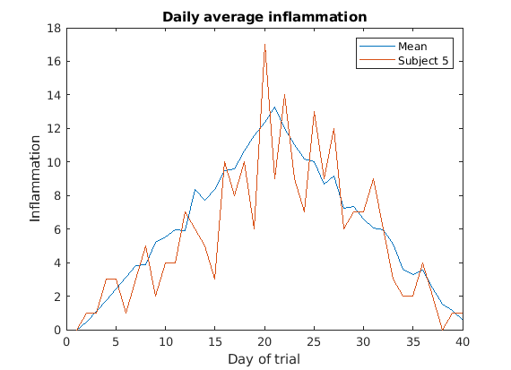

::::::::::::::::::::::::::::::::::::::: objectives

- "Compare and contrast MATLAB function files with MATLAB scripts."
- "Define a function that takes arguments."
- "Test a function."
- "Recognize why we should divide programs into small, single-purpose functions."

::::::::::::::::::::::::::::::::::::::::::::::::::

:::::::::::::::::::::::::::::::::::::::: questions

- "How can I teach MATLAB how to do new things?"

::::::::::::::::::::::::::::::::::::::::::::::::::


In the `patient_analysis` script we created,
we can choose which patient to analyse by modifying the variable `patient_number`.
If we want patient 13, we need to open `patient_analysis.m`, go to line 9, modify the variable,
save and then run `patient_analysis`.
This is a lot of steps for such a simple request.

We have used a few predefined Matlab functions, to which we can provide arguments.
So how can we define a function in Matlab?

A MATLAB function *must* be saved in a text file with a `.m` extension.
The name of that file must be the same as the function defined
inside it. The name must start with a letter and cannot contain spaces.

The first line of our function is called the *function definition*.
Anything following the function definition line is called the *body* of the
function. The keyword `end` marks the end of the function body, and the
function won't know about any code after `end`.

A function can have multiple input and output parameters if required,
but isn't required to have any of either.
The general form of a function is shown in the pseudo-code below:

```matlab
function [out1, out2] = function_name(in1, in2)
    % FUNCTION_NAME   Function description
    %    Can add more text for the function help
    %    An example is always useful!

    % This section below is called the body of the function
    out1 = something calculated;
    out2 = something else;
end
```

Just as we saw with scripts, functions must be _visible_ to MATLAB, i.e.,
a file containing a function has to be placed in a directory that
MATLAB knows  about. The most convenient of those directories is the
current working directory.

:::::::::::::::::::::::::::::::::::::::::  callout

## GNU Octave

In common with MATLAB, Octave searches the current working directory and
the path for functions called from the command line.

::::::::::::::::::::::::::::::::::::::::::::::::::

We already have a `.m` file called `patient_analysis`, so lets define a function with that name.

Open the `patient_analysis.m` file, if you don't already have it open.
Instead of line 9, where `patient_number` is set, we want to provide that variable as an input.
So lets remove that line, and right at the top of our script we'll add the function definition
telling matlab what our function is called and what inputs it needs.
```matlab
function patient_analysis(patient_number)
    % PATIENT_ANALYSIS   Computes mean, max and min of a patient and compares to global statistics.
    %    Takes the patient number as an input, and prints the relevant information to console.
    %    Sample usage:
    %       patient_analysis(5)

    % Load patient data
    patient_data = readmatrix('data/inflammation-01.csv');

    % Compute global statistics
    g_mean = mean(patient_data(:));
    g_max = max(patient_data(:));
    g_min = min(patient_data(:));

    % Compute patient statistics
    p_mean = mean(patient_data(patient_number,:));
    p_max = max(patient_data(patient_number,:));
    p_min = min(patient_data(patient_number,:));

    % Compare patient vs global
    disp('Patient:')
    disp(patient_number)
    disp('High mean?')
    disp(p_mean > g_mean)
    disp('Highest max?')
    disp(p_max == g_max)
    disp('Lowest min?')
    disp(p_min == g_min)

end
```

Congratulations! You've now created a Matlab function.

You may have noticed that the code inside the function is indented.
Matlab does not need this, but it makes it much more readable!

Lets clear our workspace and run our function in the command line:
```matlab
>> clear
>> clc
>> patient_analysis(13)
```
```output
Patient 5:
High mean?
   1
Highest max?
   0
Lowest min?
   1
```

So now we can get the patient analysis of whichever patient we want,
and we do not need to modify `patient_analysis.m` anymore.
However, you may have noticed that we have no variables in our workspace.
Inside the function, the variables `patient_data`, `g_mean`, `g_max`, `g_min`, `p_mean`,
`p_max`, and `p_min` are created, but then they are deleted when the function ends.

This is one of the major differences between scripts and functions:
a script can be thought of as automating the command line,
with full access to all variables in the base workspace,
whereas a function has its own separate workspace.

To be able to access variables from your workspace, you have to pass them in as inputs.
To be able to save variables to your workspace, it needs to return them as outputs.

Lets say, for example, that we want to save the mean of each patient.
In our `patient_analysis.m` we already compute the value and save it in `p_mean`,
but we need to tell matlab that we want the function to return it.

To do that we modify the function definition like this:
```matlab
function p_mean = patient_analysis(patient_number)
```

It is important that the variable name is the same that is used inside the function.

If we now run our function in the command line, we get:
```matlab
p13 = patient_analysis(13)
```
```output
Patient 5:
High mean?
   1
Highest max?
   0
Lowest min?
   1

p13 =
    6.2250
```

We could return more outputs if we want.
For example, lets return the min and max as well.
To do that, we need to specify all the outputs in square brackets, as an array.
So we need to replace the function definition for:
```matlab
function [p_mean,p_max,p_min] = patient_analysis(patient_number)
```

To call our function now we need to provide space for all 3 outputs,
so in the command line, we run it as:
```matlab
[p13_mean,p13_max,p13_min] = patient_analysis(13)
```
```output
Patient 5:
High mean?
   1
Highest max?
   0
Lowest min?
   1
p13_mean =
    6.2250
p13_max =
    17
p13_min =
     0
```

:::::::::::::::::::::::::::::::::::::::::  callout

**Note**
If you had not provided space for all the outputs,
Matlab assumes you are only interested in the first one,
so `ans` would save the mean.

::::::::::::::::::::::::::::::::::::::::::::::::::

:::::::::::::::::::::::::::::::::::::::  challenge

## Plotting daily average of different data files

Look back at the `plot_daily_average` script.
The data and resulting image file names are hard-coded in the script.
We actually have 12 datafiles.
Turn the script into a function that lets you generate the plots for any of the files.

The function should operate on a single data file,
and should have two parameters: `data_file` and `plot_file`.
When called, the function should create the three graphs,
and save the plot as `plot_file`.

You should mostly be reusing code from the `plot_all` script.

:::::::::::::::  solution

```matlab
function plot_daily_average(data_file,plot_name)
    %PLOT_DAILY_AVERAGE   Plots daily average, max and min inflammation accross patients.
    %   The function takes the data in data_file and saves it as plot_name
    %   Example usage:
    %       plot_daily_average('data/inflammation-03.csv','results/plot3.png')

    % Load patient data
    patient_data = readmatrix(data_file);

    figure('visible', 'off')

    % Plot average inflammation per day
    subplot(1, 3, 1)
    plot(mean(patient_data, 1))
    title('Daily average inflammation')
    xlabel('Day of trial')
    ylabel('Inflammation')

    % Plot max inflammation per day
    subplot(1, 3, 2)
    plot(max(patient_data, [], 1))
    title('Max')
    ylabel('Inflammation')
    xlabel('Day of trial')

    % Plot min inflammation per day
    subplot(1, 3, 3)
    plot(min(patient_data, [], 1))
    title('Min')
    ylabel('Inflammation')
    xlabel('Day of trial')

    % Save plot in 'results' folder as png image:
    saveas(gcf,plot_name)

    close()
end
```

:::::::::::::::::::::::::

::::::::::::::::::::::::::::::::::::::::::::::::::

:::::::::::::::::::::::::::::::::::::::  challenge

## Plotting patient vs mean

Create a function called `patient_vs_mean` that generates a plot like this one:

{alt='Plotting patient vs mean'}

The function should have the following inputs:

- `per_day_mean` - A 1D array with the average inflamation per day already loaded
(you'll have to load the data and compute per_day_mean before calling the function).

- `pataient_data` - A 1D array with the data for the patient of interest only.

- `patient_reference` - A string that will be used to identify the patient on the plot,
and also as a file name (you should add the extension `png` in your function).

When called, the function should create and save the plot as `patient_reference`.png in the results folder.

Look back at the previous lessons if you need to!

:::::::::::::::  solution

```matlab
function patient_vs_mean(per_day_mean,pataient_data,patient_reference)
    % PATIENT_VS_MEAN   Plots the global mean and patient inflamation on top of each other.
    %   per_day_mean should be a vector with the global mean.
    %   pataient_data should be a vector with only the patient data.
    %   patient_reference will be used to identify the patient on the plot.
    %
    %   Sample usage:
    %       patient_data = readmatrix('data/inflammation-01.csv');
    %       per_day_mean = mean(patient_data);
    %       patient_vs_mean(per_day_mean,patient_data(5,:),"Subject 5")

    figure('visible', 'off')

    %Plot per_day_mean
    plot(per_day_mean,'DisplayName',"Mean")
    legend
    title('Daily average inflammation')
    xlabel('Day of trial')
    ylabel('Inflammation')

    %Overlap patient data
    hold on
    plot(pataient_data,'DisplayName',patient_reference)
    hold off

    % Save plot
    saveas(gcf,"results/"+patient_reference+".png")

    close()

end
```

:::::::::::::::::::::::::

::::::::::::::::::::::::::::::::::::::::::::::::::


:::::::::::::::::::::::::::::::::::::::: keypoints

- "Break programs up into short, single-purpose functions with meaningful names."
- "Define functions using the `function` keyword."

::::::::::::::::::::::::::::::::::::::::::::::::::
