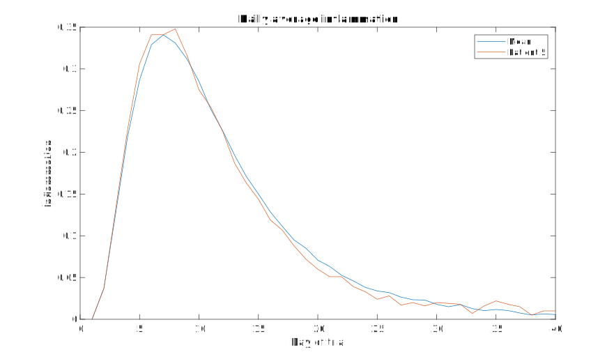

::::::::::::::::::::::::::::::::::::::: objectives

- Learn how to write a function
- Define a function that takes arguments.
- Compare and contrast MATLAB function files with MATLAB scripts.
- Recognize why we should divide programs into small, single-purpose functions.

::::::::::::::::::::::::::::::::::::::::::::::::::

:::::::::::::::::::::::::::::::::::::::: questions

- How can I teach MATLAB to do new things?
- How can I make programs I write more reliable and re-usable?

::::::::::::::::::::::::::::::::::::::::::::::::::

## Writing functions from scratch

It has come to our attention that the data about inflammation that we've been analysing contains some systematic errors. 
The measurements were made using the incorrect scale, with inflammation recorded in Arbitrary Inflammation Units (AIU) 
rather than the scientific standard International Inflmmation Units (IIU). Luckily there is a handy formula which can be 
used for converting measurements in AIU to IIU, but it involves some hard to remember constants:

```matlab
inflammation_IIU = (inflammation_AIU + B)*A
B = 5.634
A = 0.275
```
There are twelve files worth of data to be converted from AIU to IIU: is there a way we can do this quickly and 
conveniently? If we have to re-enter the conversion formula multiple times, the chance of us getting the constants 
wrong is high. Thankfully there is a convenient way to teach MATLAB how to do new things, like converting units from 
AIU to IIU. We can do this by writing a function.

We have already used some predefined MATLAB functions which we can pass arguments to. How can we define our own?

A MATLAB function *must* be saved in a text file with a `.m` extension.
The name of the file must be the same as the name
of the function defined in the file.

The first line of our function is called the *function definition* and must include the special `function` keyword to 
let MATLAB know that we are defining a function. Anything following the function definition line is called the *body*
of the function. The keyword `end` marks the end of the function body. The function only knows about code that comes
between the function definition line and the `end` keyword. It will not have access to variables from outside this block
of code apart from those that are passed in as *arguments* or *input parameters*. The rest of our code won't have access 
to any variables from inside this block, apart from those that are passed out as *output parameters*.

A function can have multiple input and output parameters as required, but doesn't have to have any. The general form
of a function is shown in the pseudo-code below:

```matlab
function [out1, out2] = function_name(in1, in2)
    % FUNCTION_NAME   Function description
    %    Can add more text for the function help
    %    An example is always useful!

    % This section below is called the body of the function
    out1 = calculation using in1 and in2;
    out2 = another calculation;
end
```

Just as we saw with scripts, functions must be _visible_ to MATLAB,
i.e., a file containing a function has to be placed in a directory that MATLAB knows about.
Following the same logic we used with scripts,
we will put our source code files in the `src` folder.

Let's put this into practice to create a function that will teach MATLAB to use our AIU to IIU conversion formula.
Create a file called `inflammation_AIU_to_IIU.m` in the `src` folder,
enter the following function definition, and save the file:

```matlab
function inflammation_in_IIU = inflammation_AIU_to_IIU(inflammation_in_AIU)
   % INFLAMMATION_AIU_TO_IIU  Convert inflammation mesured in AIU to inflammation measued in IIU.

   A = 0.275;
   B = 5.634;

   inflammation_in_IIU = (inflammation_in_AIU + B)*A;

end
```
We can now call our function as we would any other function in MATLAB:

```matlab
>> inflammation_AIU_to_IIU(0.5)
```

```output
ans = 1.6869
```

We got the number we expected, and at first glance it seems like it is almost the same as a script.
However, if you look at the variables in the workspace, you'll probably notice one big difference.
Although a variable called `inflammation_in_IIU` was defined in the function, it does not exist in our workspace.

Lets have a look using the debugger to see what is happening.

When we pass a value, like `0.5`, to the function, it is assigned to the variable `inflammation_in_AIU` so that it can 
be used in the body of the function. To return a value from the function, we must assign that value to the variable
`inflammation_in_IIU` from our function definition line. What ever value `inflammation_in_IIU` has when the `end` 
keyword in the function definition is reached, that will be the value returned.

Outside the function, the variables `inflammation_in_AIU`, `inflammation_in_IIU`, `A`, and `B` aren't accessible; they
are only used by in function body.

This is one of the major differences between scripts and functions: a script can be thought of as automating the command line, with full access to all variables in the base workspace, whereas a function has its own separate workspace.

To be able to access variables from your workspace inside a function, you have to pass them in as inputs.
To be able to save variables to your workspace, it needs to return them as outputs.

As with any operation, if we want to save the result, we need to assign the result to a variable, for example:

```matlab
>> val_in_IIU = inflammation_AIU_to_IIU(0.5)
```

```output
val_in_IIU = 1.6869
```

And we can see `val_in_IIU` saved in our workspace.

:::::::::::::::::::::::::::::::::::::::  challenge

## Writing your own conversion function

We'd like a function that reverses the conversion of AIU to IIU. Re-arrange the conversion
formula and write a function called `inflammation_IIU_to_AIU` that converts inflammation measued in IIU to inflammation
measured in AIU.

Remember to save your function definition in a file with the required name, start the file with the function definition 
line, followed by the function body, ending with the `end` keyword.

:::::::::::::  solution

```matlab
function inflammation_in_AIU = inflammation_IIU_to_AIU(inflammation_in_IIU)
   % INFLAMMTION_IIU_TO_AIU   Convert inflammation measured in IIU to inflammation measured in AIU.

   A = 0.275;
   B = 5.634;

   inflammation_in_AIU = inflammation_in_IIU/A - B;

end
```

:::::::::::::::::::::::::

::::::::::::::::::::::::::::::::::::::::::::::::::

:::::::::::::::::::::::::::::::::::::::::  callout

## Functions that work on arrays

One of the benefits of writing functions in MATLAB is that often they will also be able to operate on an array of numerical variables *for free*.

This will work when each operation in the function can be applied to an array too.
In our example, we are adding a number and multiplying by another, both of which work on arrays.

This will make converting the inflammation data in our files using the function we've just written very quick. Give it 
a go!

::::::::::::::::::::::::::::::::::::::::::::::::::

## Transforming scripts into functions

In the `patient_analysis` script we created, we can choose which patient to analyse by modifying the variable 
`patient_number`. If we want information about patient 13, we need to open `patient_analysis.m`, go to line 9, modify 
the variable, save and then run `patient_analysis`. This is a lot of steps for such a simple request.

Can we use what we've learned about writing functions to transform (or *refactor*) our script into a function, increasing 
its usefulness in the process?

We already have a `.m` file called `patient_analysis`, so lets begin by defining a function with that name.

Open the `patient_analysis.m` file, if you don't already have it open.
Instead of line 9, where `patient_number` is set, we want to provide that variable as an input.
So lets remove that line, and right at the top of our script we'll add the function definition
telling matlab what our function is called and what inputs it needs. The function will take the variable `patient_number`
as input and since we removed the line that assigned a value to that variable, the input will decide which patient is
analysed.

```matlab
function patient_analysis(patient_number)
    % PATIENT_ANALYSIS   Computes mean, max and min of a patient and compares to global statistics.
    %    Takes the patient number as an input, and prints the relevant information to console.
    %    Sample usage:
    %       patient_analysis(5)

    % Load patient data
    patient_data = readmatrix('data/base/inflammation-01.csv');

    % Compute global statistics
    g_mean = mean(patient_data(:));
    g_max = max(patient_data(:));
    g_min = min(patient_data(:));

    % Compute patient statistics
    p_mean = mean(patient_data(patient_number,:));
    p_max = max(patient_data(patient_number,:));
    p_min = min(patient_data(patient_number,:));

    % Compare patient vs global
    disp('Patient:')
    disp(patient_number)
    disp('High mean?')
    disp(p_mean > g_mean)
    disp('Highest max?')
    disp(p_max == g_max)
    disp('Lowest min?')
    disp(p_min == g_min)

end
```

Congratulations! You've now created a Matlab function from a Matlab script!

You may have noticed that the code inside the function is indented. Matlab does not need this, but it makes it much more 
readable!

Lets clear our workspace and run our function in the command line:
```matlab
>> clear
>> clc
>> patient_analysis(13)
```
```output
Patient 13:
High mean?
   0
Highest max?
   0
Lowest min?
   1
```

So now we can get the patient analysis of whichever patient we want,
and we do not need to modify `patient_analysis.m` anymore.
However, you may have noticed that we have no variables in our workspace.
Remember, inside the function, the variables
`patient_data`, `g_mean`, `g_max`, `g_min`, `p_mean`, `p_max`, and `p_min` are created,
but then they are deleted when the function ends.
If we want to save them, we need to pass them as outputs.

Lets say, for example, that we want to save the mean of each patient.
In our `patient_analysis.m` we already compute the value and save it in `p_mean`,
but we need to tell matlab that we want the function to return it.

To do that we modify the function definition like this:
```matlab
function p_mean = patient_analysis(patient_number)
```

It is important that the variable name is the same that is used inside the function.

If we now run our function in the command line, we get:
```matlab
p13 = patient_analysis(13)
```
```output
Patient 5:
High mean?
   0
Highest max?
   0
Lowest min?
   1

p13 =
    0.1049
```

We could return more outputs if we want.
For example, lets return the min and max as well.
To do that, we need to specify all the outputs in square brackets, as an array.
So we need to replace the function definition for:
```matlab
function [p_mean,p_max,p_min] = patient_analysis(patient_number)
```

To call our function now we need to provide space for all 3 outputs,
so in the command line, we run it as:
```matlab
[p13_mean,p13_max,p13_min] = patient_analysis(13)
```
```output
Patient 5:
High mean?
   0
Highest max?
   0
Lowest min?
   1
p13_mean =
    0.1049
p13_max =
    0.3450
p13_min =
     0
```

:::::::::::::::::::::::::::::::::::::::::  callout

**Note**
If you had not provided space for all the outputs,
Matlab assumes you are only interested in the first one,
so `ans` would save the mean.

::::::::::::::::::::::::::::::::::::::::::::::::::

:::::::::::::::::::::::::::::::::::::::  challenge

## Plotting daily average of different data files

Look back at the `plot_daily_average` script.
The data and resulting image file names are hard-coded in the script.
We actually have 12 datafiles.
Turn the script into a function that lets you generate the plots for any of the files.

The function should operate on a single data file,
and should have two parameters: `data_file` and `plot_file`.
When called, the function should create the three graphs,
and save the plot as `plot_file`.

You should mostly be reusing code from the `plot_all` script.

:::::::::::::::  solution

```matlab
function plot_daily_average(data_file,plot_name)
    %PLOT_DAILY_AVERAGE   Plots daily average, max and min inflammation accross patients.
    %   The function takes the data in data_file and saves it as plot_name
    %   Example usage:
    %       plot_daily_average('data/base/inflammation-03.csv','results/plot3.png')

    % Load patient data
    patient_data = readmatrix(data_file);

    figure(visible='off')

    % Define tiled layout and labels
    tlo = tiledlayout(1,3);
    xlabel(tlo,'Day of trial')
    ylabel(tlo,'Inflammation')

    % Plot average inflammation per day
    nexttile
    plot(mean(patient_data, 1))
    title('Average')

    % Plot max inflammation per day
    nexttile
    plot(max(patient_data, [], 1))
    title('Max')

    % Plot min inflammation per day
    nexttile
    plot(min(patient_data, [], 1))
    title('Min')

    % Save plot in 'results' folder as png image:
    saveas(gcf,plot_name)

    close()
end
```

:::::::::::::::::::::::::

::::::::::::::::::::::::::::::::::::::::::::::::::

:::::::::::::::::::::::::::::::::::::::  challenge

## Plotting patient vs mean

Create a function called `patient_vs_mean` that generates a plot like this one:

{alt='Plotting patient vs mean'}

The function should have the following inputs:

- `per_day_mean` - A 1D array with the average inflamation per day already loaded
(you'll have to load the data and compute per_day_mean before calling the function).

- `pataient_data` - A 1D array with the data for the patient of interest only.

- `patient_reference` - A string that will be used to identify the patient on the plot,
and also as a file name (you should add the extension `png` in your function).

When called, the function should create and save the plot as `patient_reference`.png in the results folder.

Look back at the previous lessons if you need to!

:::::::::::::::  solution

```matlab
function patient_vs_mean(per_day_mean,patient_data,patient_reference)
    % PATIENT_VS_MEAN   Plots the global mean and patient inflamation on top of each other.
    %   per_day_mean should be a vector with the global mean.
    %   pataient_data should be a vector with only the patient data.
    %   patient_reference will be used to identify the patient on the plot.
    %
    %   Sample usage:
    %       patient_data = readmatrix('data/base/inflammation-01.csv');
    %       per_day_mean = mean(patient_data);
    %       patient_vs_mean(per_day_mean,patient_data(5,:),"Patient 5")

    figure(visible='off')

    %Plot per_day_mean
    plot(per_day_mean,DisplayName="Mean")
    legend
    title('Daily average inflammation')
    xlabel('Day of trial')
    ylabel('Inflammation')

    %Overlap patient data
    hold on
    plot(pataient_data,DisplayName=patient_reference)
    hold off

    % Save plot
    saveas(gcf,"results/"+patient_reference+".png")

    close()

end
```

:::::::::::::::::::::::::

::::::::::::::::::::::::::::::::::::::::::::::::::


:::::::::::::::::::::::::::::::::::::::: keypoints

- A MATLAB function *must* be saved in a text file with a `.m` extension. The name of the file must be the same as the name
of the function defined in the file.
- Define functions using the `function` keyword to start the definition, and close the definition with the keyword `end`.
- Functions have an independent workspace. Access variables from your workspace inside a function by passing them as inputs. Access variables from the function returning them as outputs.
- The header of a dunction with inputs an outputs has the form:

```function [output_1,output_2,...] = function_name(input_1,input_2,...)```

- Break programs up into short, single-purpose functions with meaningful names.

::::::::::::::::::::::::::::::::::::::::::::::::::
