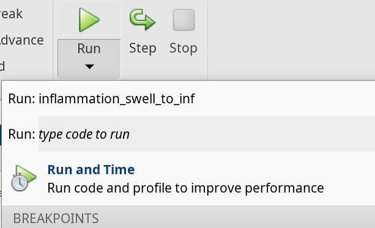
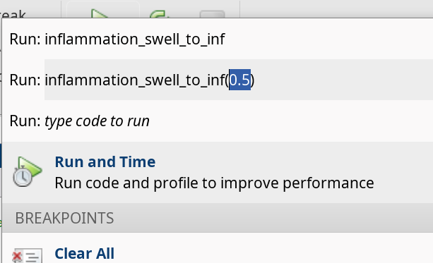
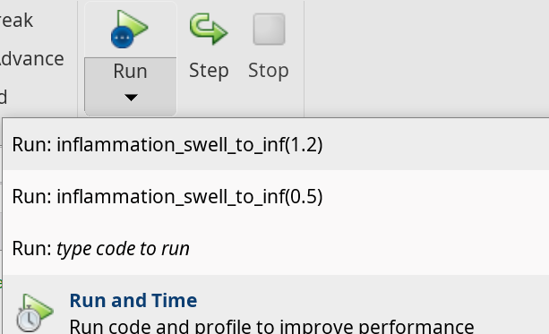

::::::::::::::::::::::::::::::::::::::: objectives

- Learn how to write a function
- Define a function that takes arguments.
- Compare and contrast MATLAB function files with MATLAB scripts.
- Recognise why we should divide programs into small, single-purpose functions.

::::::::::::::::::::::::::::::::::::::::::::::::::

:::::::::::::::::::::::::::::::::::::::: questions

- How can I teach MATLAB to do new things?
- How can I make programs I write more reliable and re-usable?

::::::::::::::::::::::::::::::::::::::::::::::::::

## Writing functions from scratch

It has come to our attention that the data about inflammation that we've been analysing contains some systematic errors.
The measurements were made using the incorrect scale, with inflammation recorded in units of Swellocity (swell)
rather than the scientific standard units of Inflammatons (inf). Luckily there is a handy formula which can be
used for converting measurements in Swellocity to Inflammatons, but it involves some hard to remember constants:

```matlab
>> A = 0.275
>> B = 5.634
>> inf = (swell + B)*A
```
There are twelve files worth of data to be converted from Swellocity to Inflammatons: is there a way we can do this quickly and
conveniently? If we have to re-enter the conversion formula multiple times, the chance of us getting the constants
wrong is high. Thankfully there is a convenient way to teach MATLAB how to do new things, like converting units from
Swellocity to Inflammatons. We can do this by writing a function.

We have already used some predefined MATLAB functions which we can pass arguments to. How can we define our own?

A MATLAB function *must* be saved in a text file with a `.m` extension.
The name of the file must be the same as the name
of the function defined in the file.

The first line of our function is called the *function definition* and must include the special `function` keyword to
let MATLAB know that we are defining a function. Anything following the function definition line is called the *body*
of the function. The keyword `end` marks the end of the function body. The function only knows about code that comes
between the function definition line and the `end` keyword. It will not have access to variables from outside this block
of code apart from those that are passed in as *arguments* or *input parameters*. The rest of our code won't have access
to any variables from inside this block, apart from those that are passed out as *output parameters*.

A function can have multiple input and output parameters as required, but doesn't have to have any. The general form
of a function is shown in the pseudo-code below:

```matlab
function [out1, out2] = function_name(in1, in2)
    % FUNCTION_NAME   Function description
    %    Can add more text for the help
    %    An example is always useful!

    % This section below is called the body of the function
    out1 = calculation using in1 and in2;
    out2 = another calculation;
end
```

Just as we saw with scripts, functions must be _visible_ to MATLAB,
i.e., a file containing a function has to be placed in a directory that MATLAB knows about.
Following the same logic we used with scripts,
we will put our source code files in the `src` folder.

Let's put this into practice to create a function that will teach MATLAB to use our Swellocity to Inflammaton conversion formula.
Create a file called `inflammation_swell_to_inf.m` in the `src` folder,
enter the following function definition, and save the file:

```matlab
function inf = inflammation_swell_to_inf(swell)
   % INFLAMMATION_SWELL_TO_INF  Convert inflammation measured in Swellocity to inflammation measured in Inflammatons.

   A = 0.275;
   B = 5.634;

   inf = (swell + B)*A;
end
```
We can now call our function as we would any other function in MATLAB:
```matlab
>> inflammation_swell_to_inf(0.5)
```
```output
ans = 1.6869
```

:::::::::::::::::::::::::::::::::::::::::  callout

## Run button for functions with inputs

When we wanted to run a script we could just click the `run` button in the editor.
For a function without inputs, we can do the same.
However, when we have a function with inputs, like the one we just created, we will get an error if we try.

This is because the `run` button doesn't know what to pass as the input to the function.
We need to specify the value of the input, which is why we ran the function in the command line.

There is an alternative, for when we want to run the function with the same input multiple times.
The `run` button has a drop-down menu that allows us to specify the input value.
To do that, select the option `type code to run`.

{alt='Drop-down menu with the option "type code to run"' width=50%}

This will prompt you with a pre-filled line of code that you can modify to pass the input value.

{alt='Prompt with pre-filled line of code and filled input value' width=50%}

Remember to hit `enter` to run the code.

Once you've done that, the run code will use that value without having to go into the dropdown menu.
You'll also find the option to run the code with your specified values in the drop-down menu.
You can add different input values to the code and run it again.

{alt='Drop-down menu with the options to run the code with the previously specified input values' width=50%}

::::::::::::::::::::::::::::::::::::::::::::::::::

We got the number we expected, and at first glance it seems like it is almost the same as a script.
However, if you look at the variables in the workspace, you'll notice one big difference.
Although a variable called `inf` was defined in the function, it does not exist in our workspace.

Lets have a look using the debugger to see what is happening.

When we pass a value, like `0.5`, to the function, it is assigned to the variable `swell` so that it can
be used in the body of the function. To return a value from the function, we must assign that value to the variable
`inf` from our function definition line. What ever value `inf` has when the `end`
keyword in the function definition is reached, that will be the value returned.

Outside the function, the variables `swell`, `inf`, `A`, and `B` aren't accessible; they
are only used by in function body.

This is one of the major differences between scripts and functions: a script automates the command line, with full access to all variables in the base workspace, whereas a function has its own separate workspace.

To be able to access variables from your workspace inside a function, you have to pass them in as inputs.
To be able to save variables to your workspace from inside your function, the function needs to return them as outputs.

As with any operation, if we want to save the result, we need to assign the result to a variable, for example:

```matlab
>> val_in_inf = inflammation_swell_to_inf(0.5)
```
```output
val_in_inf = 1.6869
```

And we can see `val_in_inf` saved in our workspace.

:::::::::::::::::::::::::::::::::::::::  challenge

## Writing your own conversion function

We'd like a function that reverses the conversion of Swellocity to Inflammatons. Re-arrange the conversion
formula and write a function called `inflammation_inf_to_swell` that converts inflammation measured in Inflammatons to inflammation
measured in Swellocity.

Remember to save your function definition in a file with the required name,
start the file with the function definition line, followed by the function body, ending with the `end` keyword.

For reference the conversion formula to take inflammation measured in Swellocity to inflammation measured in Inflammatons is:

```matlab
>> A = 0.275
>> B = 5.634
>> inf = (swell + B)*A
```

:::::::::::::  solution

```matlab
function swell = inflammation_inf_to_swell(inf)
   % INFLAMMTION_INF_TO_SWELL   Convert inflammation measured in Inflammatons to inflammation measured in Swellocity.

   A = 0.275;
   B = 5.634;

   swell = inf/A - B;
end
```

:::::::::::::::::::::::::

::::::::::::::::::::::::::::::::::::::::::::::::::

:::::::::::::::::::::::::::::::::::::::::  callout

## Functions that work on arrays

One of the benefits of writing functions in MATLAB is that often they will also be able to operate on an array of numerical variables *for free*.

This will work when each operation in the function can be applied to an array too.
In our example, we are adding a number and multiplying by another, both of which work on arrays.

This will make converting the inflammation data in our files using the function we've just written very quick. Give it a go!

::::::::::::::::::::::::::::::::::::::::::::::::::

## Transforming scripts into functions

In the `plot_patient_inflammation_option` script we created in the previous episode,
we can choose which patient to by modifying the variable `patient_number`,
and whether to show on screen or save by modifying the variable `save_plots`.
Because it is a script, we need to open the script, modify the variables, save and then run it.
This is a lot of steps for such a simple request.

Can we use what we've learned about writing functions to transform (or *refactor*) our script into a function,
increasing its usefulness in the process?

We already have a `.m` file called `plot_patient_inflammation_option`, so lets begin by defining a function with that name.

Open the `plot_patient_inflammation_option.m` file, if you don't already have it open.
Instead of lines 5 and 7, where `save_plots` and `patient_number` are set, we want to provide the variables as inputs.

So lets remove those lines, and right at the top of our script we'll add the function definition,
telling MATLAB what our function is called and what inputs it needs.
The function will take the variables `patient_number` and `save_plots` as inputs,
which will decide which patient is plotted and whether the plot is saved or displayed on screen.

```matlab
function plot_patient_inflammation_option(patient_number, save_plots)
   % PLOT_PATIENT_INFLAMMATION_OPTION   Plots daily average, max and min inflammation.
   %    Inputs:
   %       patient_number - The patient number to plot
   %       save_plots - A boolean to decide whether to save the plot to disk (if true) or display it on screen (if false).
   %    Sample usage:
   %       plot_patient_inflammation_option(5, false)

   pn_string = num2str(patient_number);

   % Load patient data
   patient_data = readmatrix("data/base/inflammation-01.csv");
   per_day_mean = mean(patient_data);
   per_day_max = max(patient_data);
   per_day_min = min(patient_data);
   patient = patient_data(patient_number,:);
   day_of_trial = 1:40;

   if save_plots == true
      figure(visible='off')
   else
      figure
   end
   clf;

   % Define tiled layout and labels
   tlo = tiledlayout(1,2);
   xlabel(tlo,"Day of trial")
   ylabel(tlo,"Inflammation")

   % Plot average inflammation per day with the patient data
   nexttile
   title("Average")
   hold on
   plot(day_of_trial, per_day_mean, "DisplayName", "Mean")
   plot(day_of_trial, patient, "DisplayName", "Patient " + pn_string)
   legend
   hold off

   % Plot max and min inflammation per day with the patient data
   nexttile
   title("Max and Min")
   hold on
   plot(day_of_trial, per_day_max, "DisplayName", "Max")
   plot(day_of_trial, patient, "DisplayName", "Patient " + pn_string)
   plot(day_of_trial, per_day_min, "DisplayName", "Min")
   legend
   hold off

   if save_plots == true
      % Save plot in "results" folder as png image:
      saveas(fig,"results/patient_" + pn_string + ".png")

      close(fig)
end
```

Congratulations! You've now created a MATLAB function from a MATLAB script!

You may have noticed that the code inside the function is indented.
MATLAB does not need this, but it makes it much more readable!

Lets clear our workspace and run our function in the command line:
```matlab
>> clear
>> clc
>> patient_analysis(13,true)
>> patient_analysis(21,false)
```

You will see the plot for patient 13 saved in the `results` folder, and the plot for patient 21 displayed on screen.

So now we can get the patient plots of whichever patient we want,
and we do not need to modify the script anymore.

However, you may have noticed that we have no variables in our workspace.
Remember, inside the function the variables are created,
but then they are deleted when the function ends.
If we want to save them, we need to pass them as outputs.

Lets say, for example, that we want to save the data of the patient in question.
In our `patient_analysis.m` we already extract the data and save it in `patient`,
but we need to tell MATLAB that we want the function to return it.

To do that we modify the function definition like this:
```matlab
function patient = plot_patient_inflammation_option(patient_number, save_plots)
```

It is important that the variable name is the same that is used inside the function.

If we now run our function in the command line, we get:
```matlab
>> p13 = patient_analysis(13,true);
```

And the variable `p13` is saved in our workspace.

We could return more outputs if we want.
For example, lets return the global mean as well.
To do that, we need to specify all the outputs in square brackets, as an array.
So we need to replace the function definition for:
```matlab
function [per_day_mean,patient] = plot_patient_inflammation_option(patient_number, save_plots)
```

To call our function now we need to provide space for all of the outputs,
so in the command line, we run it as:
```matlab
>> [mean,p13] = patient_analysis(13,true);
```
And now we have the global mean saved in the variable `mean`.

:::::::::::::::::::::::::::::::::::::::::  callout

**Note**
If you had not provided space for all the outputs,
Matlab assumes you are only interested in the first one,
so `ans` would save the mean.

::::::::::::::::::::::::::::::::::::::::::::::::::

:::::::::::::::::::::::::::::::::::::::  challenge

## Separation of concerns

Now that we know how to write functions, we can start to make our code *modular*,
separating the different parts of our program into small functions that can be reused.

Our `plot_patient_inflammation_option` function is already quite long.
You might remember that we have used the data loading and preparation in other scripts.
- Can you extract that section of the code and put it into a separate function?
- Then, refactor the `plot_patient_inflammation_option` function to use this new function.

:::::::::::::  solution

For the data loading and preparation we will need the `patient_number` as an input,
and we will return the `per_day_mean`, `per_day_max`, `per_day_min`, `patient`, and `day_of_trial` variables.

```matlab
function [day, patient, mean, max, min] load_and_prepare_data(patient_number)
   % LOAD_AND_PREPARE_DATA   Load patient data and prepare it for plotting.
   %    Inputs:
   %       patient_number - The patient number to plot
   %    Outputs:
   %       day - The day of the trial
   %       patient - The patient data
   %       mean - The mean inflammation per day
   %       max - The max inflammation per day
   %       min - The min inflammation per day
   %    Sample usage:
   %       [day, patient, mean, max, min] = load_and_prepare_data(5)

   % Load patient data
   patient_data = readmatrix("data/base/inflammation-01.csv");
   per_day_mean = mean(patient_data);
   per_day_max = max(patient_data);
   per_day_min = min(patient_data);
   patient = patient_data(patient_number,:);
   day_of_trial = 1:40;
end
```

Then, we need to modify the `plot_patient_inflammation_option` function to use this new function.
```matlab
function plot_patient_inflammation_option(patient_number, save_plots)
   % PLOT_PATIENT_INFLAMMATION_OPTION   Plots daily average, max and min inflammation.
   %    Inputs:
   %       patient_number - The patient number to plot
   %       save_plots - A boolean to decide whether to save the plot to disk (if true) or display it on screen (if false).
   %    Sample usage:
   %       plot_patient_inflammation_option(5, false)

   pn_string = num2str(patient_number);

   [day, patient, mean, max, min] = load_and_prepare_data(patient_number);

   if save_plots == true
      figure(visible='off')
   else
      figure
   end
   clf;

   % Define tiled layout and labels
   tlo = tiledlayout(1,2);
   xlabel(tlo,"Day of trial")
   ylabel(tlo,"Inflammation")

   % Plot average inflammation per day with the patient data
   nexttile
   title("Average")
   hold on
   plot(day, mean, "DisplayName", "Mean")
   plot(day, patient, "DisplayName", "Patient " + pn_string)
   legend
   hold off

   % Plot max and min inflammation per day with the patient data
   nexttile
   title("Max and Min")
   hold on
   plot(day, max, "DisplayName", "Max")
   plot(day, patient, "DisplayName", "Patient " + pn_string)
   plot(day, min, "DisplayName", "Min")
   legend
   hold off

   if save_plots == true
      % Save plot in "results" folder as png image:
      saveas(fig,"results/patient_" + pn_string + ".png")

      close(fig)
end
```

There are a few other things we could extract into separate functions.
For example, we can make functions that generate the individual plots in each tile.
This would make our `plot_patient_inflammation_option` function even more readable and modular,
and would allow us to reuse the plotting functions in other scripts.
:::::::::::::::::::::::::

::::::::::::::::::::::::::::::::::::::::::::::::::

:::::::::::::::::::::::::::::::::::::::: keypoints

- A MATLAB function *must* be saved in a text file with a `.m` extension. The name of the file *must* be the same as the name
of the function defined in the file.
- Define functions using the `function` keyword to start the definition, and close the definition with the keyword `end`.
- Functions have an independent workspace. Access variables from your workspace inside a function by passing them as inputs. Access variables from the function returning them as outputs.
- The header of a function with inputs an outputs has the form:

```function [output_1,output_2,...] = function_name(input_1,input_2,...)```

- Break programs up into short, single-purpose functions with meaningful names.

::::::::::::::::::::::::::::::::::::::::::::::::::
